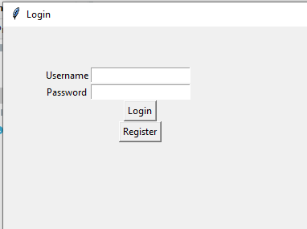
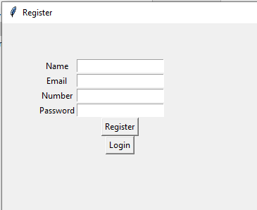

# Python-Tkinter-MainMenu

<code>first.py</code>

<h3>Screenshot</h3>

<code>second.py (Using Classes and Objects)</code>
<h3>Screenshot</h3>

<code>third.py (Window Resize)</code>
<h3>Screenshot</h3>

