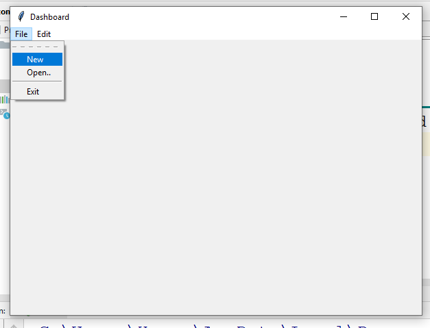

# Python-Tkinter-MainMenu

<code>first.py (Login Page)</code>

<h3>Screenshot</h3>

<code>second.py (Register Page)</code>
<h3>Screenshot</h3>

<code>third.py (Dashboard Page)</code>
<h3>Screenshot</h3>

